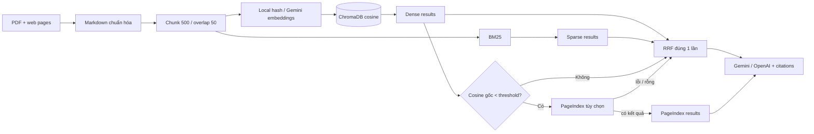

# RAG Pipeline — chính sách giáo dục Việt Nam

Ứng dụng hỏi đáp có căn cứ trên văn bản chính thức về học phí, tuyển sinh và đào tạo đại học. Pipeline hoàn chỉnh gồm thu thập dữ liệu → chuẩn hóa Markdown → chunk → local/Gemini embedding → ChromaDB → dense + BM25 → RRF → PageIndex fallback tùy chọn → Gemini/OpenAI generation có citation → Streamlit.

## Trạng thái và yêu cầu key

- Mặc định chỉ `GEMINI_API_KEY` là cần thiết cho generation. Retrieval dùng hash embedding local nên không cần thêm key hay tải model.
- `PAGEINDEX_API_KEY` không bắt buộc. Khi trống hoặc dịch vụ lỗi, pipeline trả kết quả hybrid thay vì crash.
- OpenAI và Anthropic là provider tùy chọn. Muốn dùng OpenAI, cài extra `openai`, điền `OPENAI_API_KEY` và đổi `LLM_PROVIDER=openai`.
- Có thể chuyển sang Gemini embedding để tăng semantic quality; provider thực tế dùng lúc index được lưu lại để query không bao giờ dùng nhầm vector space.

> Không commit `.env` hay API key thật. `.gitignore` đã chặn `.env`; `.env.example` chỉ chứa placeholder.

## Quick start trên Windows PowerShell

Từ thư mục `K4-L3A-RAG-Pipeline`:

```powershell
python -m venv .venv
.\.venv\Scripts\Activate.ps1
python -m pip install --upgrade pip setuptools wheel
python -m pip install -e ".[dev]"
python -m playwright install chromium
Copy-Item .env.example .env
```

Chromium là công cụ chuẩn bị theo yêu cầu Lab và sẵn sàng cho nguồn cần trình duyệt. Các nguồn hiện tại của project được thu thập bằng HTTP trực tiếp nên chatbot không cần khởi động Chromium khi chạy.

Trên Linux/macOS, thay lệnh kích hoạt và copy file bằng:

```bash
source .venv/bin/activate
cp .env.example .env
```

Mở `.env`, chỉ cần điền:

```dotenv
LLM_PROVIDER=gemini
LLM_MODEL=
GEMINI_MODEL=gemini-flash-lite-latest
OPENAI_MODEL=gpt-5.6-luna
OPENAI_API_KEY=
GEMINI_API_KEY=your_gemini_key_here
EMBEDDING_PROVIDER=hash
EMBEDDING_MODEL=local-hash
```

Trong workspace hiện tại, nếu `.env` đã có key thì không copy đè file đó.

Điền thành viên, mã học viên, vai trò và nhánh làm việc trong `TEAMMATES.md` trước khi bắt đầu commit. Mỗi thành viên lưu báo cáo riêng theo mẫu `reports/<mssv>-<ten>.md` và dẫn đúng commit/PR của phần mình thực hiện.

Để chuyển sang OpenAI:

```powershell
python -m pip install -e ".[openai]"
```

```dotenv
LLM_PROVIDER=openai
OPENAI_API_KEY=your_openai_key_here
```

Không cần đổi `LLM_MODEL`: ứng dụng tự chọn `GEMINI_MODEL` hoặc `OPENAI_MODEL` theo provider. OpenAI API cần có số dư/quota riêng; gói ChatGPT không tự động cấp credit cho API.

### Chạy toàn bộ lần đầu

```powershell
python -m src.task1_collect_legal_docs
python -m src.task2_crawl_news
python -m src.task3_convert_markdown
python -m src.task4_chunking_indexing
python -m pytest -q
streamlit run app.py
```

Mở URL Streamlit in ra terminal, thường là `http://localhost:8501`.

Các lần sau, nếu dữ liệu và model embedding không đổi, chỉ cần:

```powershell
streamlit run app.py
```

## Dữ liệu và tiêu chí hoàn thành

Chủ đề của corpus là chính sách giáo dục Việt Nam. Task 1 tải ba PDF công khai từ Cổng thông tin Chính phủ/Bộ GD&ĐT vào `data/landing/legal/`. Task 2 thu thập năm trang chính thức thành JSON có đủ `url`, `title`, `date_crawled`, `content_markdown` trong `data/landing/news/`. Task 3 chuyển cả hai nguồn thành Markdown trong `data/standardized/`, kèm metadata `title`, `source`, `doc_type`, `url`.

Các nguồn được khai báo trực tiếp trong `src/task1_collect_legal_docs.py` và `src/task2_crawl_news.py`. Nếu một website thay URL hoặc chặn request, thay bằng một nguồn công khai tương đương; không vượt WAF/captcha.

```text
data/
├── landing/
│   ├── legal/          # ít nhất 3 PDF/DOCX gốc, mỗi file > 1 KB
│   └── news/           # ít nhất 5 JSON đủ bốn field bắt buộc
└── standardized/
    ├── legal/          # Markdown từ tài liệu pháp lý
    └── news/           # Markdown từ trang/bài viết
```

## Kiến trúc retrieval



Các invariant quan trọng:

- Dense và BM25 đọc cùng corpus chunks, cùng ID ổn định `document::chunk-N`.
- Task 4 và Task 5 dùng chung `embed_texts()` và cùng model/dimension.
- ChromaDB dùng cosine distance; dense score là `1 - distance`.
- `rerank_rrf()` chỉ được gọi một lần trong `retrieve()` và rank bắt đầu từ 1.
- Quyết định fallback dùng `dense[0].score`, không dùng RRF score.
- Lỗi PageIndex luôn rơi về hybrid.
- Citation `[1]`, `[2]` trong câu trả lời khớp thứ tự nguồn UI vì sources được trả theo đúng context đã reorder.

## Chạy và kiểm tra từng lớp

```powershell
# Thu thập + chuẩn hóa
python -m src.task1_collect_legal_docs
python -m src.task2_crawl_news
python -m src.task3_convert_markdown

# Index; upsert nên chạy lại không tạo ID trùng
python -m src.task4_chunking_indexing

# Kiểm tra riêng dense, BM25, hybrid và generation
python -m src.task5_semantic_search
python -m src.task6_lexical_search
python -m src.task9_retrieval_pipeline
python -m src.task10_generation

# Test contract + acceptance
python -m pytest tests/test_contracts.py -q
python -m pytest tests/test_acceptance.py -q
python -m pytest -q
```

## PageIndex fallback (tùy chọn)

Khi có key, điền `PAGEINDEX_API_KEY` rồi upload một lần:

```powershell
python -m src.task8_pageindex_vectorless
```

Mapping `source → doc_id` được cache trong `pageindex_doc_ids.json` và không commit. Không có key thì hàm trả danh sách rỗng; ứng dụng vẫn chạy đầy đủ bằng hybrid retrieval.

## Đánh giá A/B

`group_project/evaluation/golden_dataset.json` có 15 câu với `question`, `expected_answer`, `expected_context`. Chạy:

```powershell
python -m src.evaluate_pipeline
```

Script giữ nguyên golden set, `top_k`, corpus và scoring; chỉ đổi retrieval:

| Biến | Config A | Config B |
| --- | --- | --- |
| Retrieval | dense only | dense + BM25 + RRF |
| `use_reranking` | `False` | `True` |
| Các biến khác | giữ nguyên | giữ nguyên |

Bốn metric local, tái lập được gồm faithfulness proxy, answer relevance, context recall và context precision. Kết quả, delta và ba worst performers được ghi vào `group_project/evaluation/RESULT.md`. Đây là proxy không dùng LLM-judge; nếu báo cáo cuối khóa yêu cầu RAGAS/LLM-judge, giữ cùng hai config và thay evaluator.

## Cấu hình

| Biến | Mặc định | Ý nghĩa |
| --- | --- | --- |
| `LLM_PROVIDER` | `gemini` | `gemini`, `openai`, `anthropic` |
| `LLM_MODEL` | trống | override model cho mọi provider khi cần |
| `GEMINI_MODEL` | `gemini-flash-lite-latest` | model khi `LLM_PROVIDER=gemini` |
| `OPENAI_MODEL` | `gpt-5.6-luna` | model chi phí thấp khi `LLM_PROVIDER=openai` |
| `EMBEDDING_PROVIDER` | `hash` | `hash`, `gemini`, `sentence_transformers`, `openai` |
| `EMBEDDING_MODEL` | `local-hash` | model embedding; dùng `gemini-embedding-2` khi provider là Gemini |
| `EMBEDDING_DIM` | `768` | dimension Chroma collection |
| `EMBEDDING_FALLBACK_PROVIDER` | `hash` | fallback offline; để trống nếu muốn fail fast |
| `SCORE_THRESHOLD` | `0.30` | ngưỡng cosine gốc để thử PageIndex |

Hash embedding ưu tiên tính tái lập và chạy offline; BM25 bù cho từ khóa/số hiệu văn bản. Muốn semantic quality cao hơn, đổi `EMBEDDING_PROVIDER=gemini`, `EMBEDDING_MODEL=gemini-embedding-2` rồi index lại; lưu ý free-tier giới hạn số embedding/phút với corpus nhiều chunks.

Khi đổi embedding model/provider/dimension, xóa riêng thư mục `chroma_db/` rồi index lại để tránh vector khác dimension. Không cần cài package provider không dùng. Các extra tùy chọn:

```powershell
python -m pip install -e ".[openai]"
python -m pip install -e ".[anthropic]"
python -m pip install -e ".[local-embeddings]"
```

## Xử lý lỗi nhanh

- `Chưa có index`: chạy Task 1 → 4 theo đúng thứ tự.
- Gemini báo key/model/quota: kiểm tra `GEMINI_API_KEY`; retrieval vẫn có thể dùng hash fallback, generation sẽ safe-refuse thay vì bịa.
- OpenAI báo `insufficient_quota` hoặc `credit_balance_exhausted`: key hợp lệ nhưng tài khoản API đã hết số dư; nạp credit hoặc giữ `LLM_PROVIDER=gemini`. Ứng dụng vẫn safe-refuse thay vì crash.
- Chroma báo dimension mismatch: xóa `chroma_db/` và chạy lại Task 4 sau khi chốt embedding config.
- Trang nguồn trả 403/404: cập nhật URL trong Task 1/2 bằng nguồn chính thức khác rồi chạy lại Task 1 → 4.
- PowerShell chặn activate: có thể gọi trực tiếp `.\.venv\Scripts\python.exe -m ...` mà không cần activate.

## Tài liệu rubric

- [Module contracts](docs/MODULE_CONTRACTS.md)
- [Step-by-step guide](docs/STEP_BY_STEP.md)
- [Grading rubric](docs/GRADING_RUBRIC.md)
- [Evaluation result](group_project/evaluation/RESULT.md)
- [Individual report](group_project/ịndividual/INDIVIDUAL_REPORT.md)
